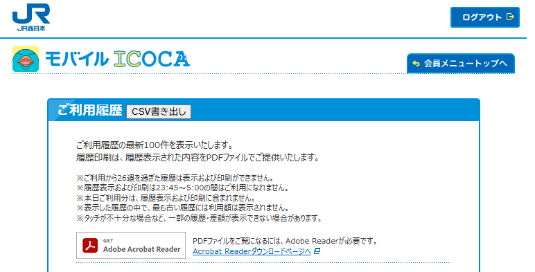

# モバイルICOCA 利用履歴CSV出力拡張機能

## 概要

モバイルICOCAの会員サイトで利用履歴をCSVとして書き出します。経費精算などに便利です。

モバイルICOCAの会員サイトでは、利用履歴を閲覧することができます。しかし、印刷することしかできません。Excelなどの外部ツールに取り込むことができないのです。

そこで、汎用的なファイル形式であるカンマ区切りでデータを保存するCSV形式として保存できる拡張機能を作成しました。

## 利用イメージ

この拡張機能をインストールしJR西日本の[モバイルICOCA会員メニュー](https://clubj.jr-odekake.net/shared/pc/login1.do?JRSSID=0401&RTURL=https://www.jr-odekake.net/&NTURL=https://web.mobileicoca.jr-odekake.net/frpc/ka/kr/AuthenticationRedirect.aspx)にログインし、履歴ページにアクセスすると上記の画像のように「CSV書き出し」ボタンが表示されます。このボタンを押すと「2025-01-01 12_32_46.csv」のようなファイル名で保存されます。

## ダウンロードページ

Coming soon...

## 注意事項

この拡張機能はJR西日本およびモバイルICOCAとは一切関係ありません。この拡張機能を利用したことによる損害や責任は一切負いかねます。
